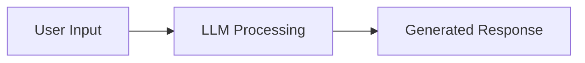
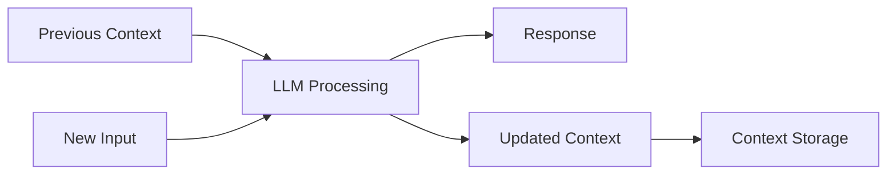
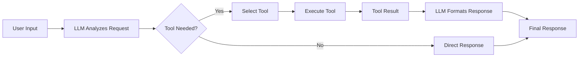
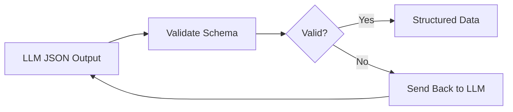
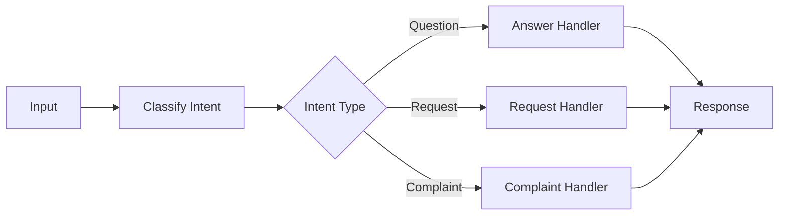
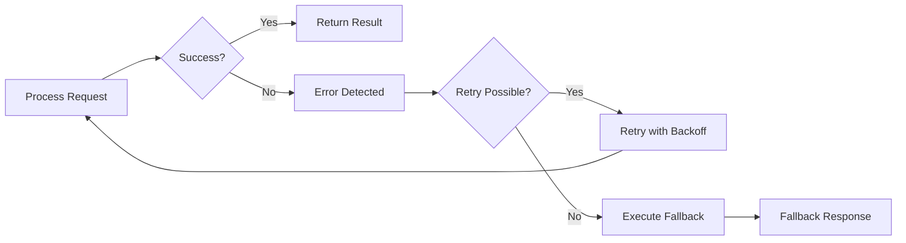
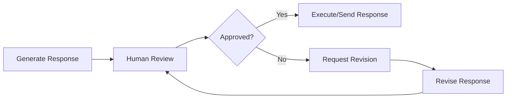

# The 7 Foundational Building Blocks of AI Agents

## What I Learned Building Real AI Applications

Here's what I've observed after trying countless agent frameworks and talking to developers building real AI products: **the frameworks aren't being used in production**.

Most successful AI applications I've seen are built with custom building blocks, not frameworks. This is because most effective "AI agents" aren't actually that agentic at all. They're mostly deterministic software with strategic LLM calls placed exactly where they add value.

The problem is that most frameworks push the "give an LLM some tools and let it figure everything out" approach. But in reality, you don't want your LLM making every decision. You want it handling the one thing it's good at - reasoning with context - while your code handles everything else.

**The solution is simpler than most frameworks make it seem.** Here's the approach that actually works:

- Break down what you're actually building into fundamental components
- Solve each problem with proper software engineering best practices  
- **ONLY INCLUDE AN LLM STEP** when it's impossible to solve with deterministic code

Making an LLM API call is the most expensive and most dangerous operation in modern software development. While incredibly powerful, you want to avoid it at all costs and only use it when absolutely necessary. 

This is especially true for background automation systems. There's a huge difference between building personal assistants (like ChatGPT, Cursor) where users are in the loop, versus building fully automated systems that process information or handle workflows without human intervention. Most of you aren't building the next ChatGPT - you're building background automations to make your work or company more efficient.

**But when you do make that LLM call, it's all about context engineering.** To get a good answer back, you need the right context at the right time sent to the right model. You need to pre-process all available information, prompts, and user input so the LLM can easily and reliably solve the problem. This is the most fundamental skill in working with LLMs.

AI agents are simply workflows - directed acyclic graphs (DAGs) if you're being precise, or just graphs if you include loops. Most steps in these workflows should be regular code - not LLM calls.

## The 7 Building Blocks

Given all of this, you only need these seven core building blocks to solve almost any business problem. Take your big problem, break it down into smaller problems, then solve each one using these building blocks chained together - that's how you build effective AI agents.

These are the fundamental primitives. But how do you actually combine them? That's where [workflow orchestration](https://github.com/daveebbelaar/ai-cookbook/tree/main/patterns/workflows) comes in - prompt chaining, routing, reflection, and other agentic patterns that emerge when you combine these building blocks strategically.

### 1. Intelligence
**The only truly "AI" component**

This is where the magic happens - and it's surprisingly simple. You send text to an LLM, it thinks about it, and sends text back. That's it. **Without this, you just have regular software.** The tricky part isn't the LLM call itself - it's everything else you need to build around it.

### 2. Memory
**Context persistence across interactions**

LLMs don't remember anything from previous messages. **Without memory, each interaction starts from scratch** because LLMs are stateless. So you need to manually pass in the conversation history each time. This is just *storing and passing conversation state* - something we've been doing in web apps forever.

### 3. Tools
**External system integration capabilities**

Most of the time you need your LLM to actually do stuff, not just chat. **Pure text generation is limited** - you want to call APIs, update databases, or read files. Tools let the LLM say "I need to call this function with these parameters" and your code handles the actual execution. This is just *normal API integration* where the LLM picks what to call and provides JSON input for the arguments.

### 4. Validation
**Quality assurance and structured data enforcement**

You need to make sure the LLM returns JSON that matches your expected schema. **LLMs are probabilistic and can produce inconsistent outputs**, so you validate the JSON output against a predefined structure. If validation fails, you can send it back to the LLM to fix it. This ensures downstream code can reliably work with the data. This is just *normal schema validation* with retry logic using tools like Pydantic, Zod, or data classes.

### 5. Control
**Deterministic decision-making and process flow**

You don't want your LLM making every decision - some things should be handled by regular code. Use if/else statements, switch cases, and routing logic to direct flow based on conditions. This is just *normal business logic and routing* that you'd write in any application.

### 6. Recovery
**Graceful failure management**

**Things will go wrong** - APIs will be down, LLMs will return nonsense, rate limits will hit you. You need try/catch blocks, retry logic with backoff, and fallback responses when stuff breaks. This is just *standard error handling* that you'd implement in any production system.

### 7. Feedback
**Human oversight and approval workflows**

Sometimes you need a human to check the LLM's work before it goes live. **Some decisions are too important or complex for full automation** - like sending emails to customers or making purchases. Add approval steps where humans can review and approve/reject before execution. This is just *basic approval workflows* like you'd build for any app.

