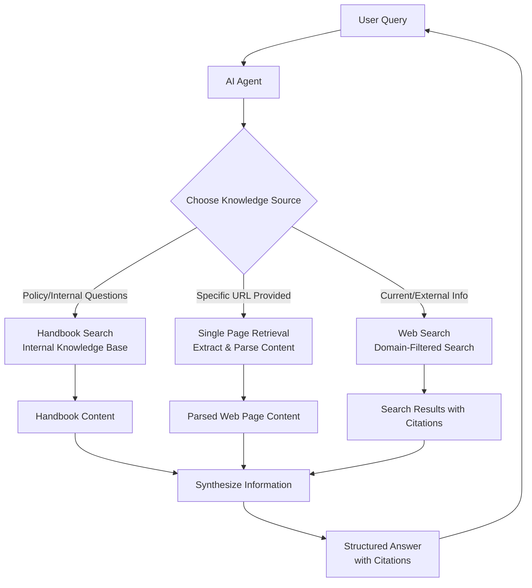

# Combining Internal Knowledge with Web Search

This tutorial walks through a common pattern in AI agent development: enhancing your agents with knowledge from multiple sources. We'll start with an internal knowledge base (like a handbook or RAG pipeline) and then supplement it with web-based information retrieval.

## The Journey

Most production AI agents need access to multiple knowledge sources:

1. **Internal Knowledge Base** - Your organization's documentation, handbooks, policies, or any curated content that forms the foundation of your agent's knowledge
2. **Single Page Retrieval** - The ability to fetch and extract content from specific web pages when users provide URLs or when the agent identifies relevant pages
3. **Web Search** - Broader internet search capabilities to find current information, updates, or content not available in your internal knowledge base

The key is building an agent that intelligently decides which knowledge source(s) to use based on the user's query, seamlessly combining internal and external information to provide comprehensive, well-cited answers.

## Prerequisites

We'll be building this agent using OpenAI's API. The requirements to follow along are available in the `requirements.txt` file in this folder.

## Agent Architecture

The agent we'll build combines three knowledge sources into a unified system:

