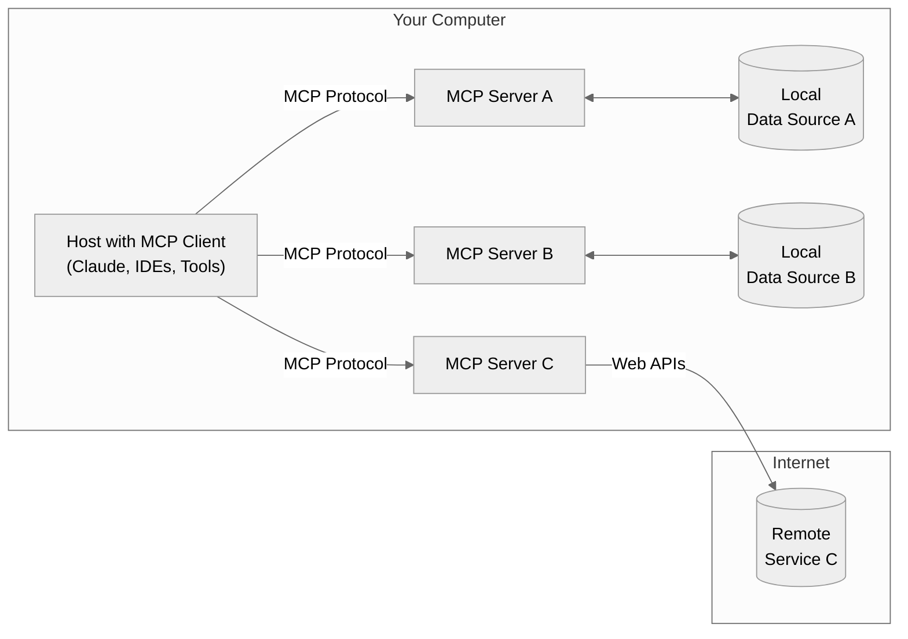

## Part 2: Understanding MCP at a Technical Level

### MCP Architecture Overview

The Model Context Protocol follows a client-host-server architecture:
This separation of concerns allows for modular, composable systems where each server can focus on a specific domain (like file access, web search, or database operations).

- **MCP Hosts**: Programs like Claude Desktop, IDEs, or your python application that want to access data through MCP
- **MCP Clients**: Protocol clients that maintain 1:1 connections with servers
- **MCP Servers**: Lightweight programs that each expose specific capabilities through the standardized Model Context Protocol (tools, resources, prompts)
- **Local Data Sources**: Your computer’s files, databases, and services that MCP servers can securely access
- **Remote Services**: External systems available over the internet (e.g., through APIs) that MCP servers can connect to

This separation of concerns allows for modular, composable systems where each server can focus on a specific domain (like file access, web search, or database operations).

MCP defines three core primitives that servers can implement:

1. **Tools**: Model-controlled functions that LLMs can invoke (like API calls, computations)
2. **Resources**: Application-controlled data that provides context (like file contents, database records)
3. **Prompts**: User-controlled templates for LLM interactions

For Python developers, the most immediately useful primitive is tools, which allow LLMs to perform actions programmatically.

### Transport Mechanisms Deep Dive

MCP supports two main transport mechanisms:

1. **Stdio (Standard IO)**: 
   - Communication occurs over standard input/output streams
   - Best for local integrations when the server and client are on the same machine
   - Simple setup with no network configuration required
   - Typically faster for local operations

2. **SSE (Server-Sent Events)**:
   - Uses HTTP for client-to-server communication and SSE for server-to-client
   - Suitable for remote connections across networks
   - Allows for distributed architectures
   - Required for certain clients like N8N

Understanding when to use each transport is crucial for building effective MCP implementations:

- Use **Stdio** when building single-application integrations or during development
- Use **SSE** when you need remote accessibility or are integrating with clients that require it

In production environments, you'll often want to support both to maximize compatibility.

### The Power of Standardization

The true power of MCP isn't in introducing new capabilities, but in standardizing how these capabilities are exposed and consumed. This provides several key advantages:

- **Reusability**: Build a server once, use it with any MCP-compatible client
- **Composability**: Combine multiple servers to create complex capabilities
- **Ecosystem growth**: Benefit from servers created by others

The MCP ecosystem is already growing rapidly, with servers available many tools. You can find an overview here: [Officially supported servers](https://github.com/modelcontextprotocol/servers)

This means you can leverage existing servers rather than reinventing the wheel, and contribute your own servers to benefit the community.
